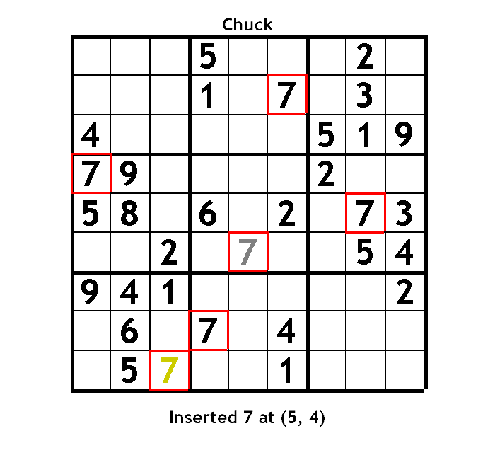

# Sudoku
Interactive Sudoku game and step-by-step solver to demonstrate principles of OOP (inheritance, polymorphism, testing, etc)

# Start
1. Install [SDL2 framework](https://www.libsdl.org/download-2.0.php).
2. Get a font (.ttf file)
3. run with `./run.sh` (soon run file will have options for type of player, etc)

# Instruction
1. Use `Player` class to play text-based
2. Use `VisualPlayer` class to play visual version - this includes helping numbers!!!
    1. Press 'space' to add helping number
    2. Press 'a' to add all available helping numbers (very helpful for technique)
    3. Double-click a helping number to remove it
    4. Press 'c' to clear all helping numbers
3. Use `CompPlayer` class to solve a puzzle text-based (techniques are currently incomplete)
    1. Use `walkThrough` option to click through step-by-step solution
4. Will have `VisualCompPlayer` class soon

# Gameplay
 

Helping Numbers

